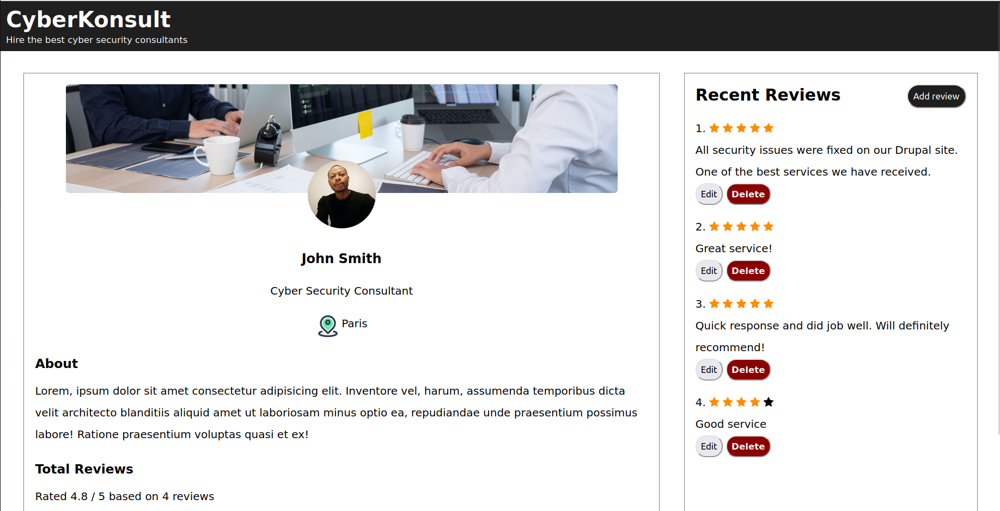
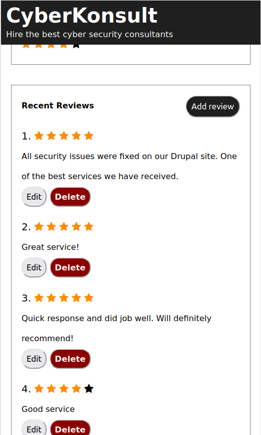

# Consultants review app 

A simple responsive consultants review app in a docker image.

## Features

- CRUD

## How to run it

- docker-compose up

- There is a database dump file in the root folder (database.sql).

## Screenshots

### Desktop view

### Mobile view

